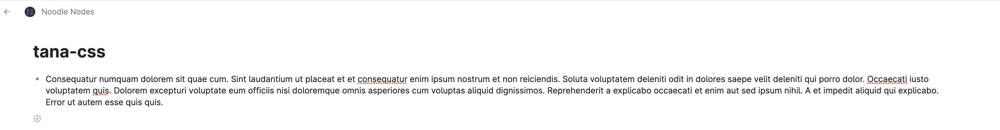

#  lineLength
This CSS snippet extends the line length to 100% of the page width.

Just add [this snippet](https://github.com/NoodleNodes/tana-css/blob/main/lineLength/lineLength-css-snippet.css) using a browser plugin like stylus (Firefox or Chrome) or cascadea (Safari).